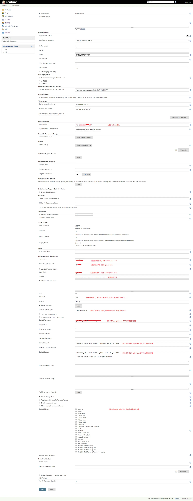
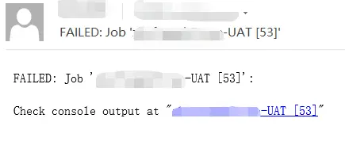
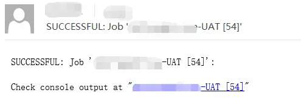

# Jenkins Pipeline 发送邮件配置

## 1、配置邮件发件人（Jenkins --> 系统管理 --> 系统设置 --> Extended E-mail Notification）




## 2、pipeline 脚本，添加 post 部分，job 构建成功或者失败时发送邮件

subject：邮件主题，可以自定义
body：邮件正文，可以自定义
to：收件人列表，根据实际情况定义
from：发件人，要和步骤 1 配置的发件人一致

```
pipeline { 
    agent any 

    parameters {
        省略内容……
    }
    environment {
        省略内容……
    }
    stages {
        省略内容……
    }
    post {
        success {
            emailext (
                subject: "SUCCESSFUL: Job '${env.JOB_NAME} [${env.BUILD_NUMBER}]'",
                body: """<p>SUCCESSFUL: Job '${env.JOB_NAME} [${env.BUILD_NUMBER}]':</p>
                    <p>Check console output at "<a href="${env.BUILD_URL}">${env.JOB_NAME} [${env.BUILD_NUMBER}]</a>"</p>""",
                to: "user1@qq.com,user2@qq.com",
                from: "admin@sina.com"
            )
        }
        failure {
            emailext (
                subject: "FAILED: Job '${env.JOB_NAME} [${env.BUILD_NUMBER}]'",
                body: """<p>FAILED: Job '${env.JOB_NAME} [${env.BUILD_NUMBER}]':</p>
                    <p>Check console output at "<a href="${env.BUILD_URL}">${env.JOB_NAME} [${env.BUILD_NUMBER}]</a>"</p>""",
                to: "user1@qq.com,user2@qq.com",
                from: "admin@sina.com"
            )
        }
    }
}
```

## 3、最终结果
构建失败时的邮件



## 构建成功时的邮件

