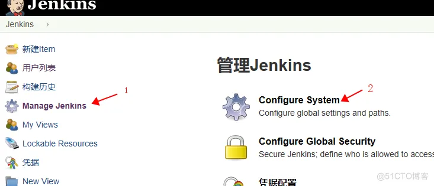
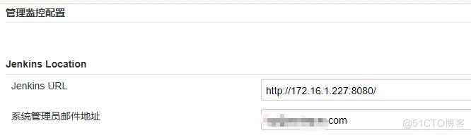
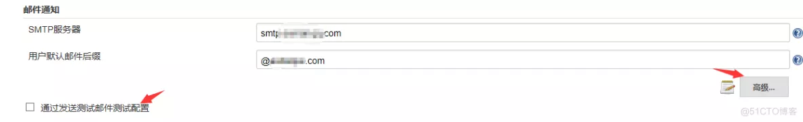
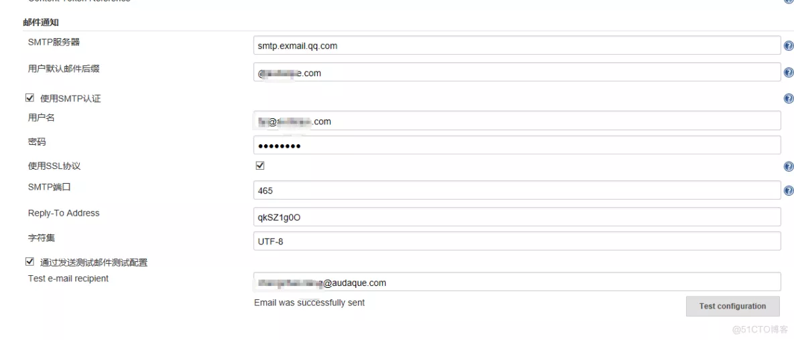
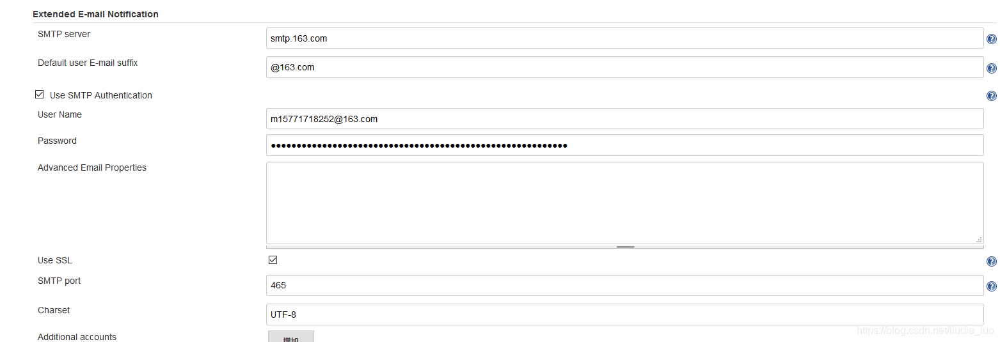

# Jenkins配置发送邮件步骤

## Jenkins配置邮件步骤，以下我是以腾讯企业邮箱账号作为演示

### 1.配置Jenkins系统管理员邮件地址：

### 下拉找到以下位置

### 2.配置邮件通知

### 继续下拉，找到邮件配置。输入SMTP服务器以及邮箱后缀，然后点击高级以及勾选测试配置

### 输入SMTP服务器，用户默认邮件后缀

### 3.进入高级配置

### 选中使用SMTP认证，输入账号密码，使用SSL协议，输入SMTP端口

### 4.点击测试邮件配置

注意事项：如果是使用QQ邮箱之类的，使用的密码是授权码，而不是平时登录的密码，所以我们必须先开启SMTP。开启SMTP后才会有授权码

but。but。当构建项目自动发送邮件时，就是行不通， 搞了一个下午才发现原因所在：原来这个地方也需要配置；大家注意啊！！！

附加，另外可能邮件提示发送成功，实际收不到，可能是部分需要更新的插件未更新，更新即可