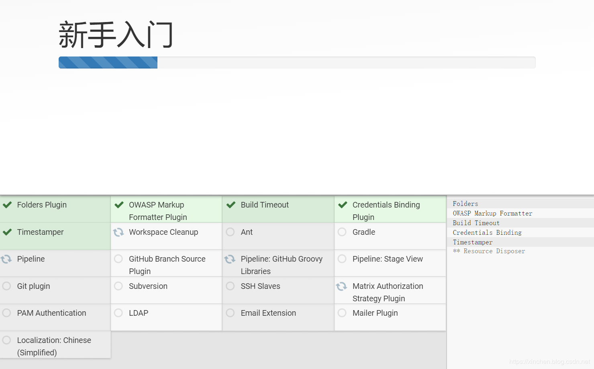
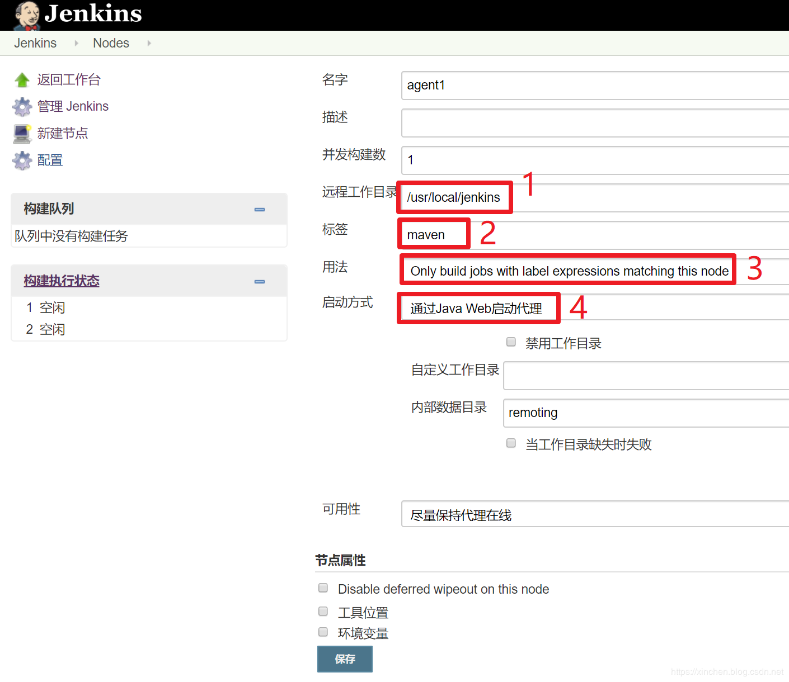

[TOC]

docker 安装jenkins集群

#环境ubuntu 20.04
###sudo snap install docker 方式安装docker
master 192.168.3.38 对应工作路径 /home/rjzou/docker/jenkins
agent1 192.168.3.36 对应工作路径 /home/rjzou/docker/jenkins
agent2 192.168.3.37 对应工作路径 /home/rjzou/docker/jenkins

# 创建Jenkins的master
## 1.在jenkins master 上执行

使用以下 docker network create 命令在 Docker 中创建桥接网络：
```
docker network create jenkins
```
要在 Jenkins 节点内执行 Docker 命令，请使用以下 docker run 命令下载并运行 Docker 映像：docker:dind
```
FROM docker:dind
ENV DOCKER_HOST=unix:///var/run/docker.sock
RUN mkdir -p /etc/docker && echo -e '{"registry-mirrors": ["https://mirror.ccs.tencentyun.com"],"insecure-registries": ["192.168.3.38:80"]}' > /etc/docker/daemon.json


```
此 Dockerfile 构建新的 docker 映像，并为该映像分配一个有意义的名称，例如“mydocker:dind”：
```
#sudo docker build -t mydocker:dind .
```


```
sudo docker run --name jenkins-docker --restart=on-failure --detach \
  --privileged --network jenkins --network-alias docker \
  --env DOCKER_TLS_CERTDIR=/certs \
  --volume /home/rjzou/docker/jenkins/jenkins-master/jenkins-docker-certs:/certs/client \
  --volume /home/rjzou/docker/jenkins/jenkins-master/jenkins-data:/var/jenkins_home \
  --publish 2376:2376 \
  mydocker:dind --storage-driver overlay2
```

创建包含以下内容的 Dockerfile：

```
FROM jenkins/jenkins:2.426.3-jdk17
USER root
RUN apt-get update && apt-get install -y lsb-release
RUN curl -fsSLo /usr/share/keyrings/docker-archive-keyring.asc \
  https://download.docker.com/linux/debian/gpg
RUN echo "deb [arch=$(dpkg --print-architecture) \
  signed-by=/usr/share/keyrings/docker-archive-keyring.asc] \
  https://download.docker.com/linux/debian \
  $(lsb_release -cs) stable" > /etc/apt/sources.list.d/docker.list
RUN apt-get update && apt-get install -y docker-ce-cli
USER jenkins
RUN jenkins-plugin-cli --plugins "blueocean docker-workflow"


```
此 Dockerfile 构建新的 docker 映像，并为该映像分配一个有意义的名称，例如“myjenkins-blueocean：2.426.3-1”：

```
#sudo docker build -t myjenkins-blueocean:2.426.3-1 .
```

```
sudo docker run --name jenkins-blueocean --restart=on-failure --detach \
  --privileged --network jenkins --env DOCKER_HOST=tcp://docker:2376 \
  --env DOCKER_CERT_PATH=/certs/client --env DOCKER_TLS_VERIFY=1 \
  --publish 8090:8080 --publish 50000:50000 \
  --volume /home/rjzou/docker/jenkins/jenkins-master/jenkins-data:/var/jenkins_home:rw\
  --volume /home/rjzou/docker/jenkins/jenkins-master/jenkins-docker-certs:/certs/client:ro \
  -e PATH="/opt/java/openjdk/bin:/usr/local/sbin:/usr/local/bin:/usr/sbin:/usr/bin:/sbin:/bin:/usr/local/maven/bin" \
  -v /home/rjzou/docker/jenkins/soft/maven:/usr/local/maven:rw \
  -v /home/rjzou/.m2:/var/jenkins_home/.m2:rw \
  -v /home/rjzou/.ssh:/var/jenkins_home/.ssh:ro \
  -v /etc/localtime:/etc/localtime:ro \
  -v /home/rjzou/docker/jenkins/timezone:/etc/timezone:ro \
  myjenkins-blueocean:2.426.3-1
```

sudo chown -R 1000:1000 ../jenkins-master


####1) 执行sudo docker logs jenkins-blueocean，会在控制台显示jenkins的登录秘钥，如下图红框所示：


####2) 浏览器输入地址：http://192.168.3.38:8090 ，显示Jenkins登录页面，如下图所示，在红框位置输入刚才复制的登录秘钥即可登录：


####3) 选择安装推荐的插件：


####4) 静候插件在线安装完成：


####5) 接下来是创建管理员和使用实例url的操作，这里就不多说了，您按实际情况自行斟酌；

至此，Jenkins的master已经搭建好，接下来将agent1和agent2作为工作节点加入集群；

## 2.加入agent1

wget http://192.168.3.38:8090/jnlpJars/agent.jar

在jenkins agent1 上执行

jdk8版本
```
sudo docker run \
  -u root \
  -idt \
  --name agent1 \
  --restart=on-failure \ 
  -v /home/rjzou/docker/jenkins:/usr/local/jenkins \
  bolingcavalry/openjdk-with-sshpass:8u232 \
  java -jar /usr/local/jenkins/agent.jar \
  -jnlpUrl http://192.168.3.38:8090/computer/agent1/jenkins-agent.jnlp \
  -secret 18ed8d7b0c15aee1420772f2bf63a6bd8aaa318b5cf82c1b9fcc609d47f8492f \
  -workDir "/home/rjzou/docker/jenkins"
```
jdk17版本
```
sudo docker run \
  -u root \
  -idt \
  --name agent1 \
  --restart=on-failure \ 
  -v /home/rjzou/docker/jenkins:/usr/local/jenkins \
  eclipse-temurin:17-jdk-alpine \
  java -jar /usr/local/jenkins/agent.jar \
  -jnlpUrl http://192.168.3.38:8090/computer/agent1/jenkins-agent.jnlp \
  -secret 729dd66cc1224ea7280633e1b94ff130a100eeed27410108000076371941b1b4 \
  -workDir "/home/rjzou/docker/jenkins"
```

上述命令中的后半部分，即java -jar ......就是前面图片红框中的agent1启动命令，唯一要改变的是将agent.jar改成绝对路径/usr/local/jenkins/agent.jar

*** 针对jdk8 ***
------------
> 上述命令的镜像是bolingcavalry/openjdk-with-sshpass:8u232，其Dockerfile内容如下，可见非常简单，就是OpenJDK镜像里面安装了sshpass，这样的容器可以在执行ssh命令时带上远程机器的密码，而不用等待用户输入密码，这样便于shell脚本执行ssh命令：

```
FROM openjdk:8u232

ARG DEBIAN_FRONTEND=noninteractive
RUN apt-get update && apt-get install --assume-yes sshpass

```
------------

#### 在Jenkins网页上新增节点，操作如下图，先进入节点管理页面：


#### 如下图，新增一个节点，名为agent1：


#### 接下来的节点详情信息如下图，注意四个红框中的内容要和图中保持一致：



#### 保存成功后会显示机器列表，如下图，图标上的红叉表示机器不在线（此时agent1还没有接入），点击红框：


#### 如下图所示，红框中的命令就是agent1的启动命令，执行该命令的机器会以agent1的身份加入集群：


#### 注意上图红框中的agent.jar是个名为agent.jar的文件的下载链接，将此文件下载到agent1电脑的/home/rjzou/docker/jenkins目录下；

#### ssh登录agent1电脑，执行以下命令，即可将agent1加入Jenkins集群：

## 3.加入agent2

agent2加入集群的方式和agent1大部分是一样的，只有以下两点要注意：

在Jenkins页面上创建节点，名称是agent2

#### agent2的标签是gradle,如下图红框所示：


#### 此时agent2也加入成功：


#### 在jenkins agent2 上执行

jdk8版本
```
sudo docker run \
-u root \
-idt \
--name agent2 \
--restart=on-failure \ 
-v /home/rjzou/docker/jenkins:/usr/local/jenkins \
bolingcavalry/openjdk-with-sshpass:8u232 \
java -jar /usr/local/jenkins/agent.jar \
-jnlpUrl http://192.168.3.38:8090/computer/agent2/jenkins-agent.jnlp \
-secret 79a788017045e3d8bcf9041b0000974efb4a8b90c6297aa6e00e5885699f5305 \
-workDir "/home/rjzou/docker/jenkins"

  ```
jdk17版本

```
sudo docker run \
-u root \
-idt \
--name agent2 \
--restart=on-failure \ 
-v /home/rjzou/docker/jenkins:/usr/local/jenkins \
eclipse-temurin:17-jdk-alpine \
java -jar /usr/local/jenkins/agent.jar \
-jnlpUrl http://192.168.3.38:8090/computer/agent2/jenkins-agent.jnlp \
-secret 9fcf5c4398bc8d661300f2b482c808c0a781c6117dc60a7252ddaef0257f9ef5 \
-workDir "/home/rjzou/docker/jenkins"
  ```

至此，Jenkins集群搭建完成，这两个节点带有不同的标签，下一篇文章《Jenkins集群下的pipeline实战》中，我们在这个集群环境创建pipeline任务，并通过标签被分配到不同的节点上，实现多节点并行执行；